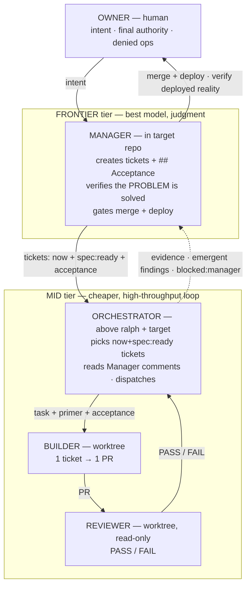

# Managed mode — the five-role architecture

**This file is the canonical picture of who does what.** If any other doc, prompt, or
skill describes the roles differently, *this file wins* — fix the other doc to match.

Managed mode is not "ralph plus a flag." It is a small **org chart**: one human, one
frontier brain, and a mid-tier loop of three workers. It looks like a lot of moving
parts; in practice it is one rule repeated at every level — **work flows down as
tickets, verification flows up as evidence.** The pattern is deliberately this shape
because it produces results that a flat "one agent does everything" loop does not: the
expensive model is spent only on judgment, and "a ticket closed" is never mistaken for
"the problem solved."

## The one-glance picture

```
                        ┌──────────────────────┐
                        │        OWNER         │   human
                        │  intent · final say  │
                        │   · denied ops       │
                        └──────────┬───────────┘
                                   │ intent / approvals
                                   ▼
   ╔═══════════════════════════════════════════════════════╗
   ║  FRONTIER tier ── the best model, judgment-dense       ║
   ║              ┌──────────────────────────┐              ║
   ║              │        MANAGER           │  in TARGET repo
   ║              │  creates tickets + ## Acceptance        │
   ║              │  verifies the PROBLEM is solved         │
   ║              │  (deployed reality, not claims)         │
   ║              │  gates MERGE + DEPLOY                   │
   ║              └────┬───────────────▲─────┘              ║
   ╚═══════════════════│═══════════════│════════════════════╝
             tickets   │               │  evidence · emergent findings
          now+spec:ready               │  verify:pending · blocked:manager
                       ▼               │
   ╔═══════════════════════════════════════════════════════╗
   ║  MID tier ── cheaper models, high-throughput loop      ║
   ║          ┌──────────────────────────────┐             ║
   ║          │        ORCHESTRATOR          │  above ralph + target
   ║          │  picks now+spec:ready tickets │             ║
   ║          │  reads the Manager's comments │             ║
   ║          │  dispatches work · routes up  │             ║
   ║          └───┬──────────────────────▲───┘             ║
   ║   task +     │                      │  PASS / FAIL     ║
   ║   primer +   ▼                      │                  ║
   ║   acceptance ┌──────────┐   PR   ┌──┴───────┐          ║
   ║              │ BUILDER  │ ─────▶ │ REVIEWER │          ║
   ║              │ 1 ticket │        │ read-only│          ║
   ║              │  → 1 PR  │        │ PASS/FAIL│          ║
   ║              └──────────┘        └──────────┘          ║
   ╚═══════════════════════════════════════════════════════╝
```

The same picture, rendered (GitHub / any mermaid viewer):



## The five roles

| Role | Model tier | Lives | Owns | Must never |
|---|---|---|---|---|
| **Owner** | human | — | Intent, final authority, and the few denied ops (credential rotation, destructive DB, IAM-denied cloud). | — |
| **Manager** | **frontier / best** | **inside the target repo** (`.claude/skills/manager/SKILL.md`) — **repo-aware**, knows it deepest | *Creating* tickets + `## Acceptance`; verifying the **problem** is solved against deployed reality; gating **merge** and **deploy**. Highest-level understanding of the repo. | Run the dispatch loop or pick tickets mechanically — that is the orchestrator's job. |
| **Orchestrator** | mid | **above ralph + the target repo** (boots where it sees both; runs `ralph init-target`) — **repo-agnostic**, does not read the target's internals | Running its hourly loop: pick up `now` + `spec:ready` tickets, read the Manager's comments, hand work to the builder, run the reviewer, **deploy dev** to verify, and **file PRs**; route arbitration + emergent findings up to the Manager. | Author acceptance, merge/approve a PR, push the default branch, **deploy prod**, implement, or ask the human. |
| **Builder** | mid | a worktree of the target — **repo-aware**, reads its `CLAUDE.md`/`AGENTS.md`, knows its components + rules | Implementing exactly one ticket, and reporting up to the Orchestrator (blockers + anything it noticed wrong). | Approve/merge a PR, push the default branch, deploy, contact the Manager, or write its own acceptance. |
| **Reviewer** | mid | a worktree (read-only) | An in-loop `PASS` / `FAIL` verdict on the builder's PR against the check + ticket. | Merge, or verify anything beyond "does this PR satisfy the ticket as written." |

## Who knows the repo, and who doesn't

This split is as important as the tiers:

- **Manager and Builder are initialized *inside* the target repo.** They read its
  `CLAUDE.md` / `AGENTS.md` and know its components, rules, and conventions. The **Manager**
  knows it deepest — it frames problems and writes acceptance. The **Builder** knows it well
  enough to change code correctly. Repo-specific facts live here.
- **The Orchestrator sits *above* the repo and deliberately does not know its internals.** It
  conveys tickets, runs the harness, and executes the Manager's `## Acceptance` commands
  **verbatim** — running a check never requires understanding the code. The Orchestrator is
  the **repo-agnostic conveyor**; the mechanical protocol (labels, dispatch, `ralph init`)
  lives here.

So when a builder spots something wrong in the code — doc drift, a dangling reference, dead
code, a security smell — it must **tell the Orchestrator**, because the Orchestrator is not in
the code and would otherwise never know. The Orchestrator then decides what to escalate to the
Manager. Observation originates at the Builder (in the repo); routing is the Orchestrator's
(above it).

## Two loops, not one

The Manager and the Orchestrator each run **their own independent loop**. This is the heart
of the design — one high-judgment loop above, one high-throughput loop below.

**The Orchestrator's loop** (hourly, autonomous):
1. Read the Manager's comments on its open PRs and any answered `blocked:manager` items first.
2. Select treatable tickets — `now` + `spec:ready` + `## Acceptance`, label-mechanical.
3. Assign to a builder; the in-loop reviewer returns PASS/FAIL; iterate.
4. Verify on **dev** (deploy dev locally, run the acceptance).
5. File a PR (noting dev-verified vs. needs-prod); move to the next ticket.

**The Manager's loop** (its own cadence):
1. **Review the PRs the Orchestrator filed** — accept (merge) or reject with comments.
2. **Investigate** tickets that need it, and turn them into Orchestrator-ready tickets
   (`spec:ready` + `## Acceptance`).
3. **Gate + run the prod deploy**; mark `verify:pending` until deployed reality confirms.

The loops meet at the PR: the Orchestrator's loop *produces* PRs, the Manager's loop
*consumes* them. Neither drives the other directly — they hand off through GitHub tickets,
PRs, comments, and labels.

## The escalation path is strictly bottom-up, one tier at a time

```
   Builder ──surfaces blocker (handoff)──▶ Orchestrator ──blocked:manager + comment──▶ Manager ──▶ Owner
```

A builder never talks to the Manager directly; it reports **up to the Orchestrator**. The
Orchestrator owns the GitHub channel to the Manager and is the one that posts `blocked:manager`
comments, files emergent findings, and does the label-mechanical ticket selection. **No role
ever asks the human for arbitration** — the Orchestrator routes everything to the Manager, and
only the Manager escalates to the Owner.

## Why the tiers, and why the frontier model stays *out* of the loop

- **Frontier (Manager)** — judgment-dense work: framing the problem, designing acceptance
  that probes the real defect, deciding whether the *problem* is actually solved, and
  gating deploys. This is where a cheap model loses money by approving a plausible-looking
  fix that doesn't hold.
- **Mid (Orchestrator + Builder + Reviewer)** — the mechanical, high-throughput loop:
  pick, implement, check. Cheap enough to run continuously.
- **Human (Owner)** — intent and the handful of operations agents are denied.

**The frontier model never runs the loop.** Putting the Manager inside dispatch would burn
the expensive model on ticket-picking *and* re-invite the exact failure it exists to catch
— because a role that both hands out and signs off on work reviews its own homework.

## Two verification altitudes (the crux of the whole design)

There are **two** checks on the work, at two different points, and they are not the same check:

1. **Reviewer verdict** (mid, *inside the Orchestrator's loop, before a PR is filed*): *Does
   the builder's diff pass the check and satisfy the ticket as written?* Fast, mechanical,
   `PASS` / `FAIL`. The Orchestrator then dev-verifies and files the PR.
2. **Manager review** (frontier, *its own loop, on the filed PR*): *Is the underlying
   **problem** actually solved in deployed reality?* The Manager reviews the Orchestrator's
   PR, accepts (merge) or rejects with comments, and gates the prod deploy — grounding on the
   deployed artifact and the live system, not the builder's description of it.

A PR can pass the in-loop reviewer *and* the Orchestrator's dev verification and still be
rejected by the Manager. **That gap is the entire reason the Manager tier exists.** "Ticket
closed" ≠ "problem solved." (Note: the Orchestrator verifies everything it can on dev; when a
check genuinely requires a prod deploy, it does **not** deploy prod — it files the PR flagging
that final verification needs prod, and defers that step to the Manager.)

## One cycle, end to end

1. The **Owner** voices intent — or the **Manager** finds a problem during its round.
2. The **Manager** turns it into a ticket with a `## Acceptance` section (exact commands +
   expected output against the deployed system) and labels it `spec:ready` + `now`.
3. The **Orchestrator** picks the top `now` + `spec:ready` ticket and hands the **Builder** a
   prompt carrying the primer, the ticket, and the Manager's repo authority-facts.
4. The **Builder** implements one ticket → one PR and runs the check.
5. The **Reviewer** returns `PASS` / `FAIL` against the check + ticket.
6. The **Orchestrator** routes the outcome: `PASS` → up to the Manager; `FAIL` → back to the
   builder; *can't solve* or *spawns new work* → a comment on the ticket (an **emergent
   finding**) up to the Manager, plus the right label.
7. The **Manager** verifies the *problem* against deployed reality, then **merges + deploys**
   (or requests changes / re-specs). It marks `verify:pending` until deployed reality
   confirms, then clears it.
8. Every state change is a **comment + label**, never a silent flip — closed issues keep the
   full audit trail forever.

## Authority flows down; discovery flows up

- **Authority / definition-of-done → the Manager, top-down.** Per-ticket `## Acceptance`, and
  repo-wide authority/safety facts (deploy entrypoints, the CI gate, environment topology,
  secret traps, denied ops). The Manager authors these; the orchestrator *delivers* the
  relevant slice into the builder's prompt. The builder never authors its own acceptance and
  never keeps its own copy of "how this repo deploys."
- **Discovery → the Builder, bottom-up.** Where a feature's code lives, local idioms, which
  test covers which change. The builder works this out on the ground and promotes only the
  *durable* bits upward as `**Emergent finding**` comments, which the orchestrator routes and
  the Manager ratifies into a ticket, a fold, or a facts-line. This is why the builder both
  *reads* Manager-authored facts **and** *figures things out itself* — the two are different
  kinds of knowledge.

## The shared channel: labels

The three parties talk through GitHub issue/PR **comments** and a **label protocol** — the
single contract every role references, defined once in
[`.agents/ralph/references/LABELS.md`](../.agents/ralph/references/LABELS.md). In short:
down-channel = `now`, `spec:ready`, `blocked:owner`; up-channel = `blocked:manager`,
`verify:pending`, `recommendation`, and emergent-finding comments. Urgency travels through
labels, not through loop speed.

## How each role boots

| Role | Bootable today | Reads to reconstruct itself |
|---|---|---|
| **Manager** | **yes** — `/manager` in the target repo | its skill + co-located `LABELS.md` + repo `CLAUDE.md`; then GitHub (`gh pr list`, `gh issue list --label now`, CI, `git log`). Fills **Project facts** on first run. |
| **Builder** | dispatched by the Orchestrator into a worktree of the target | the target's **`CLAUDE.md` / `AGENTS.md`** (repo-aware) + the assigned ticket. Reports up to the Orchestrator. |
| **Reviewer** | via the harness loop | the diff + ticket + check output (read-only). |
| **Orchestrator** | **yes** — its charter is [`.agents/ralph/ORCHESTRATOR.md`](../.agents/ralph/ORCHESTRATOR.md) in this harness; boot a mid-tier session where it sees both ralph and the target ("you are the orchestrator, initialize target `<path>`, tickets are at `<where>`, go") | its charter + `LABELS.md` + the harness; runs `ralph init-target`; reconstructs from GitHub (`gh issue list --label now --label spec:ready`, `gh pr list`, Manager comments). **Does not read the target's internals.** |

## A note on the older "three-party" framing

The integration spec (`docs/prd/manager-mode.md` in the target repo) describes managed mode
as **three parties** — Owner / Manager / "Builder (this harness)". That was a deliberate
simplification *for the harness-integration task*: it black-boxes the whole mid-tier loop
(orchestrator + builder + reviewer) as "the harness" because, from the harness's point of
view, that is one unit. Do not read it as "the Manager runs the loop." The five roles above
are the real topology; the three-party view is that topology squinted at from the harness.
